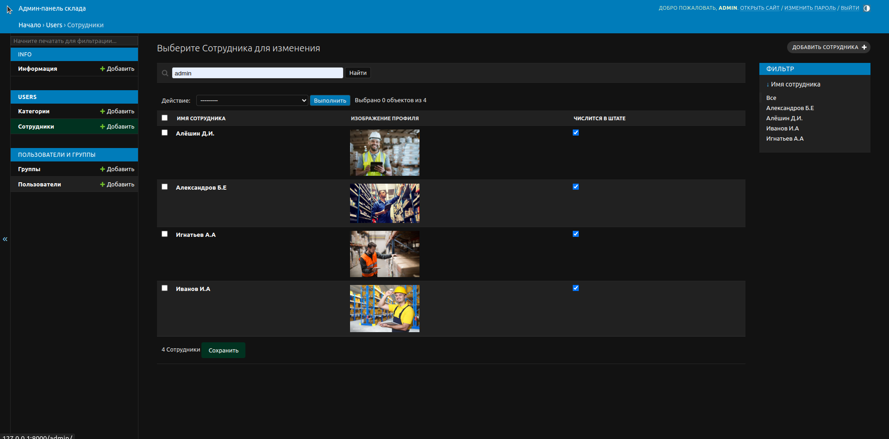

<h1>Terminal_Nestle</h1>

Программа "Терминал" предназначена для внутреннего пользования компании. Она послужила
удобством в отслеживании статистики эффективности сотрудников складских
предприятий. В разных углах территории предприятия можно подойти к Touch-панели и посмотреть актуальную
информацию о сегодняшнем дне, так же есть возможность отследить 
и с мобильного устройства если у сотрудника нет возможности или времени идти
до ближайшей Touch-панели.   В программе присутствует два раздела:  

Сотрудники  :white_check_mark:

Статистика на сегодня  :white_check_mark:

В разделе сотрудников хранится информация о всех работниках территории предприятия.
На страницы присутствует блок для выбора категории сотрудников При выборе нужной
специальности, пользователю будут доступны сотрудники категории которой он выбрал.

При выборе нужного сотрудника, пользователь перейдёт на его страницу и
может посмотреть о нём полную информацию

С помощью админ панели, начальник склада может создавать категорию сотрудников,
самих сотрудников и вносить их результат для общего отслеживания. 

    
    

Так же с помощью админ-панели можно создавать план на сегодня. Ниже изображения
когда задачи ещё не поступили.

   
Создадим задачу через админ панель.

 
После создание задания на сегодня, появляется план и показатели слева выделяются
цветами: зелёным, жёлтым, красным в зависимости регламента компании.   
В данном случае если:   
1) На сегодня план сборки меньше 25000 тыс. коробов, то зелёным.  
2) Если больше 25000 до 40000 тыс.коробов то жёлтым.   
3) Свыше 40000 тыс.коробов красным это значит что план по сборке
превысил нормы и работы в этой области очень много.
  
С остальными значениями задач анаголично.

Справа пользователь видит шкалу эффективности и нарушителей 
трудовой дисциплины, в данном случае "Нарушители перерывов" так как в проекте актуален был
такой параметр.  

Нарушителями будут считаться те сотрудники кто провёл более 3 часов
за пределами рабочий зоны.  
Общее время на всех сотрудников даётся в среднем 20 часов.
На изображении ниже можно увидеть всех нарушителей и так же можно
перейти на каждого сотрудника который нарушил требования компании
и отследить более подробно его эффективность, для дальнейшего разбирательства. 

По середине расположены графики, в них заносятся показатели всех сотрудников во едино, то есть
у нас на данный момент есть 4 категории сотрудников это - комплектовщики, 
водители которые делают перемещение паллет по складу, грузчики и погрузчики.
 

Далее берётся количество выработки каждого сотрудника определённой категории,
суммируется всё вместе и мы получаем общий показатель в цифровом и процентном соотношении.
Процент соответственно связан с планом на сегодня, к примеру если план на общее количество
сборки 5800 тыс. коробов как и указано в задачах слева, то 2000 тыс. коробов будет 34 %
а 5800 это 100%
  
Процент высчитывается динамически так же как и графики, и просчитает любую 
сумму и процент.

Эффектифность

Сотрудник находящийся вне рабочий зоны 4 часа

<h3>Для разработки:</h3>

#### 1. Создать виртуальное окружения:
for Linux / Mac:  

      python3 -m venv venv

for Windows:  

      python -m venv venv

#### Активировать:
for Linux / Mac:  

      source venv/bin/activate 
.fish(если используете)

for Windows:  

      venv\Scripts\activate
   

#### 2. Установить зависимости &#128515;:
      pip3 install -r requirements.in
#### Запустить проект локально &#129300;:
      pip3 manage.py runserver

#### localhost:
      http://127.0.0.1:8000/

<h3 align="center" class="blue">The stack used:</h3>

<b>
Python 3.11;
</b>
<b>
Django 5.0.2;
</b>
<b>
JavaScript;
</b>
<b>
Html;
</b>
<b>
Css;
</b>
<b>
Pillow;
</b>
<b>
SqLite3;
</b>

<h3>Admin-panel:</h3>

#### Перейти по адресу:
    http://127.0.0.1:8000/admin

###### Username
    admin
###### Password
    123

